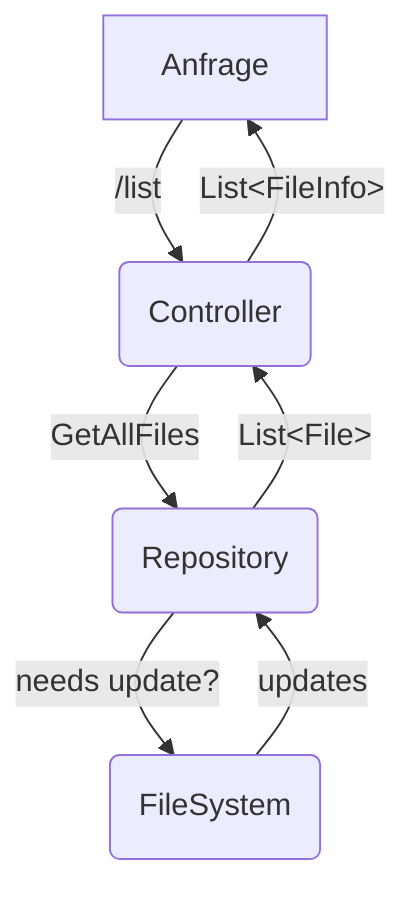

# Overview

## /list

```mermaid
flowchart TD
    A[Anfrage] -->|/list| B(Controller)
    B -->|GetAllFiles| C(Repository)
    C -->|needs update?| D(FileSystem)
    D -->|updates| C
    C -->|List#lt;File#gt;| B
    B -->|List#lt;FileInfo#gt;| A
```

## /